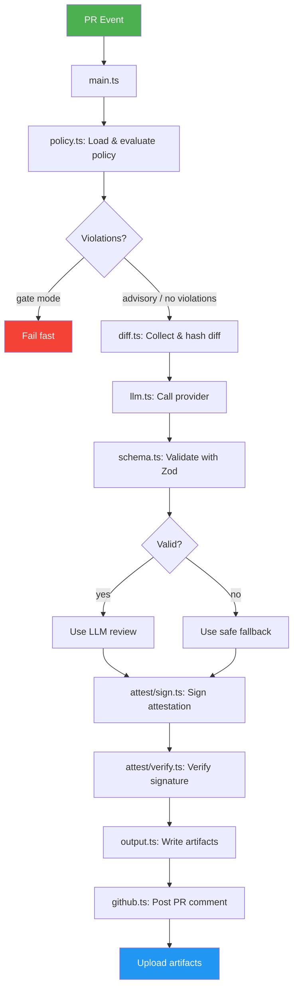
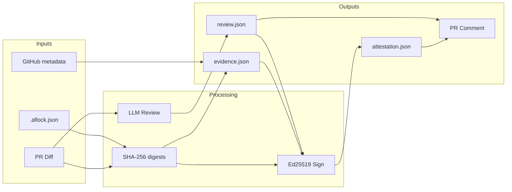

# AflockGate — Design Document

## Problem Statement

Modern software teams merge hundreds of pull requests per week. Manual code review is inconsistent, time-consuming, and lacks auditability. Existing AI review tools operate as black boxes with no verifiable chain of custody: you cannot prove *which* policy was applied, *what* diff the model saw, or *whether* the output was tampered with after generation.

**AflockGate** addresses three gaps:

1. **Policy enforcement** — Repos need file-level guardrails (e.g., deny changes to `.env`, limit blast radius) that are checked *before* an LLM review runs.
2. **Structured AI review** — LLM output should be machine-parseable (blocking/non-blocking issues, test plans), not free-form prose.
3. **Signed attestations** — Every review must produce a cryptographically signed artifact that binds the policy, evidence, and review together so any party can verify integrity offline.

## Proposed Solution

A GitHub Action that triggers on `pull_request` events and executes a deterministic pipeline:

```
PR event → Policy check → Diff collection → LLM review → Attestation → PR comment + artifacts
```

### Key Design Decisions

| Decision | Choice | Rationale |
|---|---|---|
| Runtime | GitHub Actions (Node 20) | Zero infrastructure; runs where the code lives |
| Signing | Ed25519 via tweetnacl | Fast, small keys, auditable; no PKI dependency |
| Schema validation | Zod | Runtime type safety for LLM output; catches hallucinated schemas |
| LLM abstraction | Provider interface (mock/openai/anthropic) | Testable without network; swappable in production |
| Default mode | Advisory | Safe for adoption; gate mode opt-in |

## Tech Stack & Architecture

### Stack

- **Language:** TypeScript 5.x (strict mode)
- **Runtime:** Node 20 (GitHub Actions runner)
- **Dependencies:** @actions/core, @actions/github, minimatch, tweetnacl, zod
- **Testing:** Jest + ts-jest
- **Signing:** Ed25519 (tweetnacl)
- **Hashing:** SHA-256 (Node crypto)

### Architecture



### Data Flow



### Attestation Binding

The attestation cryptographically binds three independent digests:

```
attestation.signature = Ed25519.sign(
  canonicalize({
    schemaVersion, subject,
    policyDigest:   SHA256(canonicalize(policy)),
    evidenceDigest: SHA256(canonicalize(evidence)),
    reviewDigest:   SHA256(canonicalize(review))
  }),
  privateKey
)
```

Tampering with *any* of the three artifacts invalidates the signature. The public key is embedded in the attestation for offline verification.

## Success Metrics

| Metric | Target | How Measured |
|---|---|---|
| Functional completeness | All 5 PR lifecycle steps execute | Integration test |
| Test coverage | 30+ passing tests | Jest |
| Attestation integrity | Sign → verify round-trip passes; tamper → fails | Unit tests |
| Policy enforcement | Denied files blocked, limits respected | Unit tests |
| Time to review | < 30s for mock provider | CI timing |
| Zero secret leakage | No PII/keys in logs or artifacts | Manual audit + grep |

## Test Strategy

### Unit Tests

| Suite | What's tested |
|---|---|
| `policy.test.ts` | Glob matching (allowed/denied), maxChangedFiles, combined violations |
| `attest.test.ts` | Canonicalization stability, sign+verify round-trip, tamper detection, key validation |
| `diff.test.ts` | Truncation at byte limit, newline boundary, hash consistency |

### Integration Tests

| Suite | What's tested |
|---|---|
| `integration.test.ts` | Full pipeline with mock GitHub client + mock LLM: artifact generation, comment content, attestation pass/fail, gate mode enforcement, advisory mode tolerance |

### Manual Verification

1. Open a PR in a repo using AflockGate
2. Verify comment appears with summary, blocking issues, test plan, attestation result
3. Download artifacts and verify attestation offline

## Production Plan

### Phase 1: MVP (current)
- Mock LLM provider for demos
- Ed25519 signing with repo-level key
- Advisory mode only (opt-in gate)

### Phase 2: Production Hardening
- OpenAI/Anthropic provider integration with rate limiting
- Key rotation via GitHub secret versioning
- OIDC-based keyless signing (Sigstore Fulcio)
- Artifact upload to OCI registry

### Phase 3: Enterprise
- Organization-level policy inheritance
- Policy-as-code with versioned schema
- Audit log streaming to SIEM
- Multi-reviewer quorum

## Risks & Mitigations

| Risk | Impact | Likelihood | Mitigation |
|---|---|---|---|
| LLM returns invalid JSON | Review fallback used; no blocking issues surfaced | Medium | Zod validation + safe fallback; `llm_valid=false` flag in evidence |
| Signing key compromised | Attestations can be forged | Low | Key rotation docs; short-lived keys; future: OIDC keyless |
| Diff too large for LLM context | Truncated review misses issues | Medium | Truncation with explicit marker; future: chunked review |
| Fork PRs lack secrets | Signing skipped | High (by design) | Graceful degradation: mock provider + SKIPPED attestation |
| Rate limiting by LLM provider | Review fails | Medium | Retry with backoff; mock fallback; configurable provider |
| GitHub API rate limits | Cannot fetch diff or post comment | Low | Paginated fetches; upsert comments (update existing) |

## Security Considerations

- **No secrets in code**: All keys via GitHub Secrets / environment variables
- **No diff in logs**: Diffs stored only in artifacts, not logged to CI output
- **No PII**: Mock provider generates synthetic reviews
- **Fork safety**: Missing secrets trigger graceful degradation, not failure
- **Attestation integrity**: Ed25519 signatures prevent post-hoc tampering
- **Policy transparency**: Policy digest in evidence enables audit of what rules were applied
